<p align="center">
  
</p>

<p align="center">
  <a href="../../releases/latest"><b>⬇ Baixar a ISO (versão atual)</b></a> ·
  <a href="#-experimentar-em-5-minutos">Experimentar</a> ·
  <a href="#-roteiro-uma-volta-pelo-carinaeos">Roteiro</a> ·
  <a href="#-os-apps-carinae">Apps Carinae</a> ·
  <a href="#-como-é-feito">Como é feito</a>
</p>

---

**CarinaeOS** é um sistema operacional para computadores, feito para quem quer um Linux
**bonito e fácil desde o primeiro minuto**, sem precisar abrir o terminal.

Por baixo está a solidez do **Debian 13**. Por cima, desde a versão 1.0-rc18, há um **ambiente de trabalho todo nosso**:
o gestor de janelas **Gravidade**, o shell **Aurora** (papel de parede, barra de cima, Dock e Launchpad) e uma
família de aplicativos próprios, os **apps Carinae**: Documentos, Terminal, Fotos, PDF, Notas, Calculadora, Monitor,
Emojis, Compactador e Configurações. Sem Plasma e sem KWin: mais leve, mais rápido e com uma só cara, a do CarinaeOS.

O nome vem de **Eta Carinae**, uma das estrelas mais brilhantes e instáveis da nossa galáxia.
A estrela de quatro pontas com a órbita é o símbolo do sistema.

> **Estado:** versão de testes (*release candidate*). Já dá para usar e instalar, mas ainda pode
> ter arestas. Encontrou alguma coisa? Abra uma [*issue*](../../issues).
> Durante os testes fica publicada **só a versão mais recente**: cada nova versão substitui a anterior.
> A versão anterior, com o KDE Plasma, continua no ramo [`plasma`](../../tree/plasma).

## 🧭 Roteiro: uma volta pelo CarinaeOS

Tudo o que aparece nesta página é o **ambiente do próprio CarinaeOS**: o gestor de janelas, a barra, a Dock,
o Launchpad e os aplicativos foram feitos para este sistema. Venha dar uma volta.

### 1. Ligar o computador

<table>
  <tr>
    <td width="50%"></td>
    <td width="50%">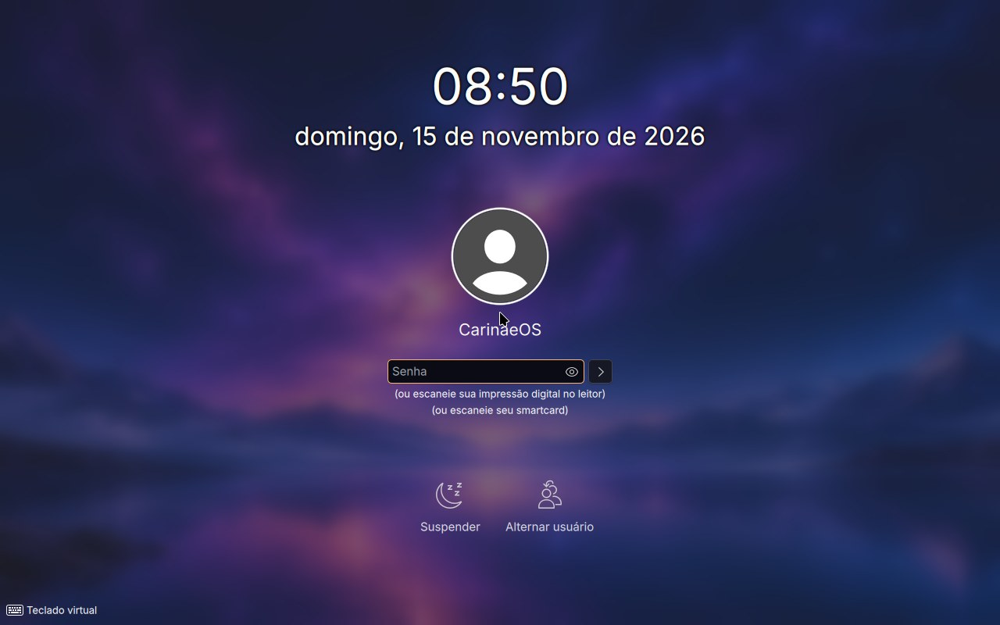</td>
  </tr>
  <tr>
    <td>O arranque já mostra a estrela do CarinaeOS, do menu de arranque ao carregamento.</td>
    <td>Na <b>tela de entrada</b>: relógio grande, a data em português e a sua foto. Escolha a sessão <b>CarinaeOS</b> e entre.</td>
  </tr>
</table>

### 2. A área de trabalho

<p align="center"></p>

Uma tela limpa: a **barra de cima** escura com o menu da estrela, o nome do aplicativo ativo, os ícones da bandeja e o
relógio; a **Dock** de vidro em baixo; e o papel de parede (nebulosa, aurora, órbita ou uma imagem sua).

### 3. O menu da estrela e a Dock

<table>
  <tr>
    <td width="50%">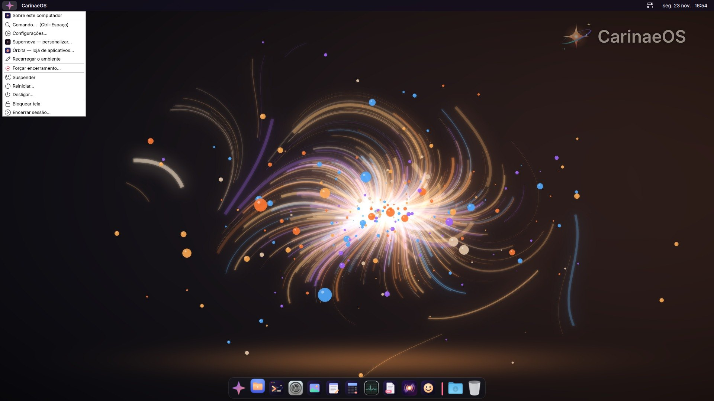</td>
    <td width="50%">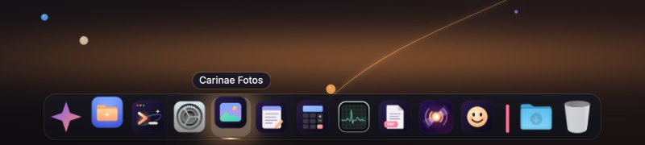</td>
  </tr>
  <tr>
    <td>A <b>estrela</b> no canto, como a maçã do Mac: sobre este computador, Comando, Configurações, Supernova, Órbita,
    forçar encerramento, suspender, reiniciar, desligar, bloquear e encerrar sessão.</td>
    <td>A <b>Dock</b>: os seus aplicativos, um ponto em baixo dos que estão abertos, <b>pré-visualização das janelas</b>
    ao passar o rato, separadores coloridos, a pasta de Transferências e o Lixo. Arraste para reorganizar.</td>
  </tr>
</table>

### 4. O Launchpad: os seus aplicativos, por ambientes

<table>
  <tr>
    <td width="50%">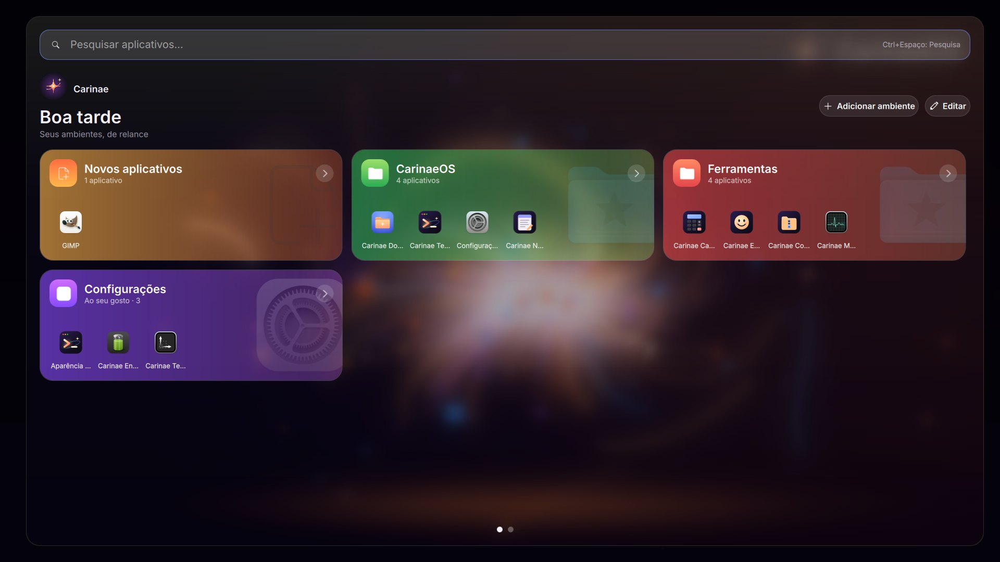</td>
    <td width="50%">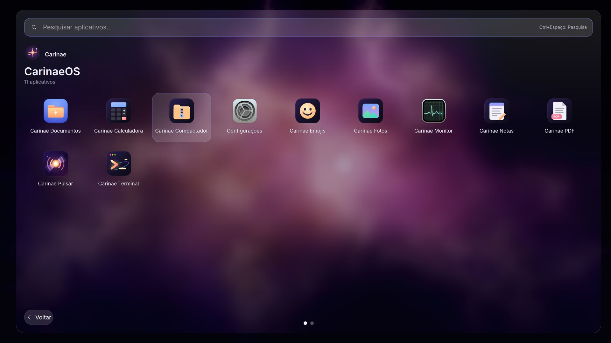</td>
  </tr>
  <tr>
    <td>Tecla <kbd>⊞</kbd> ou a estrela da Dock. Os aplicativos vivem em <b>ambientes</b> que monta como quiser:
    crie, mude o nome e a cor, ponha uma imagem como marca de água e <b>tranque com senha</b>.</td>
    <td>Abra um ambiente para ver todos os seus aplicativos. Escreva para pesquisar; setas e Enter também funcionam.
    O botão direito fixa na Dock, move para outro ambiente ou tranca.</td>
  </tr>
</table>

### 5. O Comando: pesquisar e fazer

<p align="center">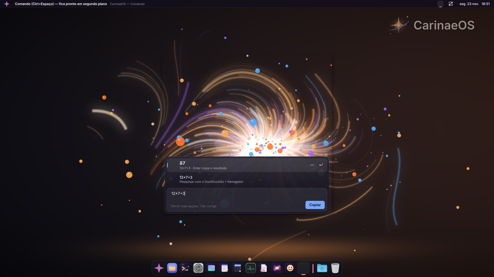</p>

<kbd>Ctrl</kbd>+<kbd>Espaço</kbd> em qualquer lugar. Encontra **aplicativos**, **arquivos** e **configurações**,
faz **contas** (o resultado vai para a área de transferência com Enter), corre **ações** do sistema (bloquear, captura de
tela, papel de parede seguinte…) e tem **extensões**: `emoji`, `cor`, `senha`, `matar`, `g`/`yt`/`wiki`, `~/` para
arquivos e `smb://` para pastas de rede. Escreva `?` para ver todas.

### 6. Os seus arquivos

<table>
  <tr>
    <td width="50%"></td>
    <td width="50%">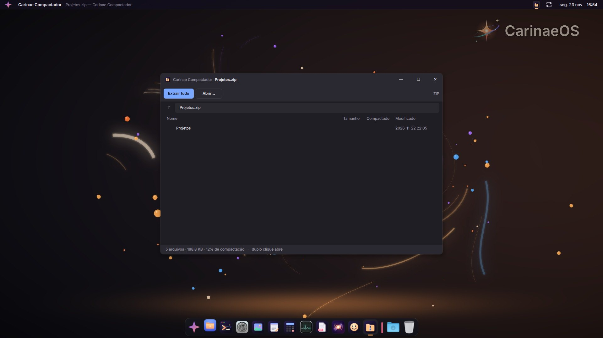</td>
  </tr>
  <tr>
    <td><b>Carinae Documentos</b>: abas, barra lateral, galeria, miniaturas, etiquetas coloridas, pastas de rede e o
    <b>Cofre</b>. No botão direito: compactar, abrir com, bloquear com senha, abrir o terminal aqui…</td>
    <td><b>Carinae Compactador</b>: abre ZIP, 7z, TAR e muitos outros formatos, navega por dentro, extrai tudo ou só
    o que escolher, e cria arquivos novos.</td>
  </tr>
</table>

### 7. O Terminal

<p align="center">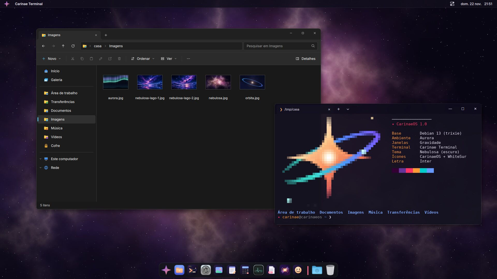</p>

O **Carinae Terminal** tem abas, temas de cores, transparência e abre em qualquer pasta (<kbd>⊞</kbd>+<kbd>Enter</kbd> ou
<kbd>Ctrl</kbd>+<kbd>Alt</kbd>+<kbd>T</kbd>). É o terminal do sistema para todos os aplicativos.

### 8. Fotos e PDF

<table>
  <tr>
    <td width="50%">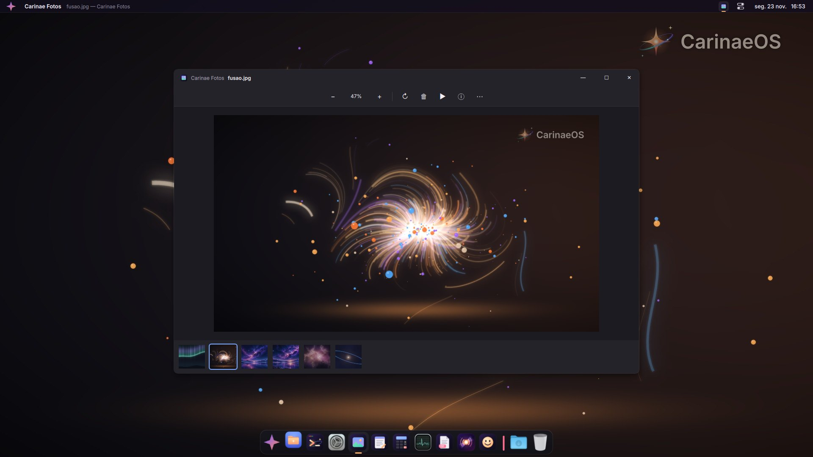</td>
    <td width="50%"></td>
  </tr>
  <tr>
    <td><b>Carinae Fotos</b>: a pasta inteira em miniaturas, zoom, rodar, apresentação, informações (EXIF) e apagar
    para o Lixo com <i>Desfazer</i>.</td>
    <td><b>Carinae PDF</b>: miniaturas das páginas, índice, pesquisa no texto, PDFs com senha, zoom com
    <kbd>Ctrl</kbd>+roda e imprimir.</td>
  </tr>
</table>

### 9. Notas, Calculadora e Emojis

<p align="center">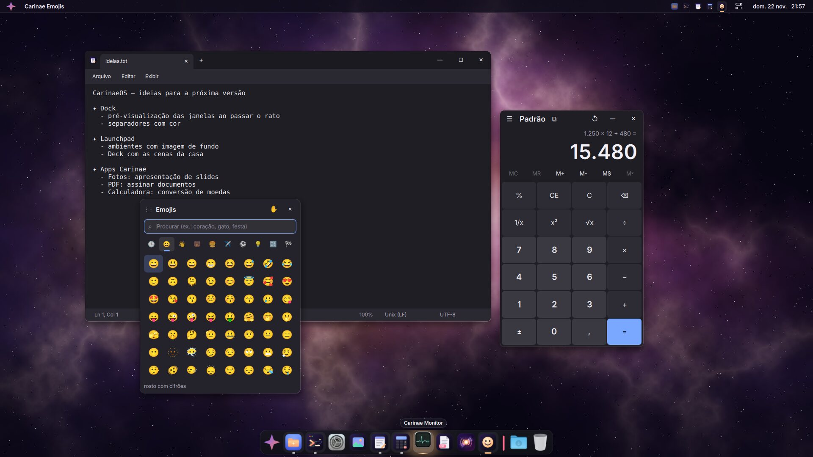</p>

**Carinae Notas** guarda as abas abertas de uma vez para a outra; a **Calculadora** tem os modos padrão e científico,
histórico e memória; os **Emojis** (<kbd>⊞</kbd>+<kbd>.</kbd>) escrevem o emoji direto onde está o cursor.

### 10. Monitor e Configurações

<table>
  <tr>
    <td width="50%"></td>
    <td width="50%">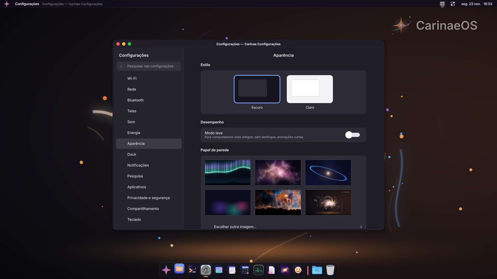</td>
  </tr>
  <tr>
    <td><b>Carinae Monitor</b>: processos, gráficos de desempenho, aplicativos de inicialização e um
    <b>teste de velocidade da internet</b> (download, upload, ping, latência e perda de pacotes).</td>
    <td><b>Carinae Configurações</b>: Wi-Fi, rede, Bluetooth, telas, som, energia, aparência, Dock, notificações,
    pesquisa, aplicativos, privacidade, compartilhamento e teclado.</td>
  </tr>
</table>

### 11. E ainda

<p align="center"></p>

A loja **Órbita** (Flathub), o **Carinae 3D** (a biblioteca dos seus modelos STL, 3MF e SVG para impressão 3D),
o **Carinae Casa** (Home Assistant), a **Música** (MPD), o **Cadeado** para pastas e aplicativos, o **Manual** e as
**Boas-vindas** depois de instalar.

### As peças

| Peça | O que é |
|---|---|
| **Gravidade** | O gestor de janelas (C++ e XCB): botões à esquerda como no Mac, encaixar nas metades e em zonas, 4 áreas de trabalho, vários monitores, <kbd>Alt</kbd>+<kbd>Tab</kbd> e atalhos que se mudam num arquivo de texto. |
| **Aurora** | O shell (Qt 6 e QML): papel de parede, a barra de cima com o menu da estrela, relógio, agenda e bandeja, a **Dock** de vidro com pré-visualização das janelas e o **Launchpad** com ambientes e o Deck. |
| **Apps Carinae** | Os aplicativos do dia a dia, feitos para o CarinaeOS, todos com o mesmo visual escuro e os mesmos atalhos. |
| **Sessão** | Entrada pelo SDDM com o tema CarinaeOS, bloqueio de ecrã, janela de senha (polkit), gestão de energia e sombras suaves (picom). |

### Novidades da rc18

- **Ambiente próprio, sem Plasma**: a Gravidade e a Aurora substituem o KWin e o Plasma. A Dock, o Launchpad e o Deck
  continuam os mesmos que já conhece.
- **Apps Carinae novos**: Terminal, Fotos, PDF, Notas, Calculadora, Emojis, Compactador e Monitor, todos com o nome
  “Carinae” à frente, e abertos por omissão para cada tipo de arquivo.
- **Carinae Terminal**: abas, temas de cores, transparência e o menu *Abrir terminal aqui* nos Documentos.
- **Carinae PDF**: miniaturas, índice, pesquisa no texto, PDFs com senha, zoom com <kbd>Ctrl</kbd>+roda e imprimir.
- **Carinae Compactador**: abre, cria e extrai ZIP, 7z e TAR (gz, xz, zst, bz2), e muitos outros formatos pelo 7-Zip, também pelo botão direito nos Documentos.
- **Comando com extensões**, no lugar do Ulauncher: escreva `emoji`, `cor`, `senha`, `matar`, `wiki` ou `?` para ver todas. As suas próprias extensões vão para `~/.local/share/carinaeos/extensoes/`.
- **Teste de velocidade da internet** no Monitor.
- **Sessão de experimentar** (ISO ao vivo) que entra sozinha no ambiente do CarinaeOS, com o instalador na Dock.
- **Telemóveis**: KDE Connect para Android e iPhone, e o iPhone ligado por USB (usbmuxd, libimobiledevice e ifuse).

## 🪐 Os apps Carinae

| App | Para quê |
|---|---|
| **Carinae Documentos** | Explorador de arquivos com abas, barra lateral, galeria, etiquetas coloridas, pastas de rede, cofre com senha e compactar/extrair no botão direito. |
| **Carinae Terminal** | Terminal com abas e temas, também como terminal do sistema. |
| **Carinae Fotos** | Ver, rodar, apresentar e arrumar as suas imagens. |
| **Carinae PDF** | Ler, pesquisar e imprimir PDFs. |
| **Carinae Notas** | Bloco de notas com abas, codificações, procurar e substituir, ir para a linha. |
| **Carinae Calculadora** | Padrão e científica, com histórico e memória, em formato brasileiro (1.250,50). |
| **Carinae Monitor** | Processos, desempenho, velocidade da internet e aplicativos de inicialização. |
| **Carinae Emojis** | Todos os emojis em português, com pesquisa e tons de pele. |
| **Carinae Compactador** | ZIP, 7z, TAR e muitos outros formatos pelo 7-Zip. |
| **Carinae Configurações** | Todas as configurações do sistema num só lugar. |
| **Comando** | A pesquisa e as ações rápidas do <kbd>Ctrl</kbd>+<kbd>Espaço</kbd>. |

E continuam no sistema as ferramentas que já existiam: a loja **Órbita** (Flathub), **Carinae Casa** (Home Assistant),
**Música** (MPD), **Carinae 3D** (biblioteca de modelos STL/3MF para impressão 3D), o **Cadeado** para pastas e
aplicativos, o **Manual** e as **Boas-vindas**.

## 📖 Manual

O **[Manual do CarinaeOS](docs/manual/00-indice.md)** explica tudo: a área de trabalho, as ferramentas,
arquivos e discos, **HD na rede e pastas partilhadas** (SMB/NAS, NFS, SSH), programas (apt, Flatpak, AppImage),
hardware e drivers, o Debian, o kernel Linux e uma referência grande de **comandos do terminal**.
Vem dentro do sistema como o aplicativo *Manual*, com pesquisa.

## ⌨️ Atalhos úteis

| Atalho | O que faz |
|---|---|
| <kbd>⊞</kbd> (tecla Windows / ⌘) | Abre o Launchpad |
| <kbd>Ctrl</kbd>+<kbd>Espaço</kbd> | Comando: aplicativos, arquivos, contas e ações |
| <kbd>Alt</kbd>+<kbd>Tab</kbd> | Troca de janela |
| <kbd>⊞</kbd>+<kbd>←</kbd> / <kbd>→</kbd> | Encaixa a janela na metade esquerda / direita |
| <kbd>⊞</kbd>+<kbd>↑</kbd> / <kbd>↓</kbd> | Maximiza / repõe ou minimiza |
| <kbd>⊞</kbd>+<kbd>Alt</kbd>+<kbd>1</kbd>…<kbd>3</kbd> | Põe a janela numa zona (25/50/25) |
| <kbd>Ctrl</kbd>+<kbd>⊞</kbd>+<kbd>←</kbd> / <kbd>→</kbd> | Área de trabalho anterior / seguinte |
| <kbd>⊞</kbd>+<kbd>1</kbd>…<kbd>9</kbd> | Abre ou mostra o aplicativo nessa posição da Dock |
| <kbd>⊞</kbd>+<kbd>D</kbd> | Mostra a área de trabalho |
| <kbd>⊞</kbd>+<kbd>E</kbd> | Abre a pasta pessoal |
| <kbd>⊞</kbd>+<kbd>Enter</kbd> ou <kbd>Ctrl</kbd>+<kbd>Alt</kbd>+<kbd>T</kbd> | Carinae Terminal |
| <kbd>⊞</kbd>+<kbd>.</kbd> | Carinae Emojis |
| <kbd>⊞</kbd>+<kbd>L</kbd> | Bloqueia o ecrã |
| <kbd>Print</kbd> | Captura de uma região (<kbd>Shift</kbd>: ecrã inteiro, <kbd>Alt</kbd>: janela) |

Todos os atalhos ficam em `~/.config/carinaeos/atalhos.conf` e podem ser mudados.

## 🚀 Experimentar em 5 minutos

1. Em [**Releases**](../../releases), abra a versão mais recente e baixe **todas as partes**
   (`CarinaeOS-1.0-amd64.iso.parte00`, `parte01`, …) e o arquivo `.sha256` para a mesma pasta.
   A ISO vem em partes porque o GitHub não aceita arquivos com mais de 2 GB.
2. Junte as partes numa única ISO:

   - **Windows**: abra a pasta, clique na barra de endereço, escreva `cmd` e Enter. Depois:
     ```
     copy /b CarinaeOS-1.0-amd64.iso.parte00 + CarinaeOS-1.0-amd64.iso.parte01 CarinaeOS-1.0-amd64.iso
     ```
     No **PowerShell**, ponha `cmd /c` antes do mesmo comando.
   - **macOS / Linux**:
     ```
     cat CarinaeOS-1.0-amd64.iso.parte* > CarinaeOS-1.0-amd64.iso
     ```

   Para confirmar que veio inteira: `sha256sum -c CarinaeOS-1.0-amd64.iso.sha256` (Linux),
   `shasum -a 256 CarinaeOS-1.0-amd64.iso` (Mac) ou `certutil -hashfile CarinaeOS-1.0-amd64.iso SHA256` (Windows).
   O código tem de ser igual ao do `.sha256`.

3. **Numa máquina virtual** (VirtualBox, VMware, GNOME Boxes…): crie uma máquina
   *Linux → Debian 64-bit* com **4 GB de memória**, **2 processadores**, **30 GB de disco** e vídeo
   **VMSVGA com 128 MB**. Use a ISO como disco de arranque.
   No VirtualBox, marque *“Pular instalação desassistida”*.

   **Num computador de verdade**: grave a ISO num pen drive de 4 GB ou mais com o
   [balenaEtcher](https://etcher.balena.io/) ou o [Rufus](https://rufus.ie/) (modo *DD*) e arranque por ele.

4. A sessão de experimentar entra **sozinha** no ambiente do CarinaeOS.
5. Gostou? Clique em **Instalar o CarinaeOS**, o primeiro ícone da Dock.
   O instalador é guiado, aceita senhas simples e sabe instalar ao lado do Windows.

> **Dica:** na sessão de experimentar, tudo o que instala ou muda fica na memória e
> desaparece quando desliga. Para guardar, instale o CarinaeOS no disco.

**Requisitos:** processador de 64 bits (x86-64), 4 GB de memória e 30 GB de disco. Funciona com e sem UEFI.

## 🛠 Como é feito

O CarinaeOS é montado com o [live-build](https://live-team.pages.debian.net/live-manual/) do
Debian. A ISO é gerada automaticamente pelo **GitHub Actions** sempre que o arquivo
[`carinae-debian/VERSAO`](carinae-debian/VERSAO) muda, e é publicada em *Releases*.
O ambiente é compilado dentro da própria ISO, a partir da pasta `ambiente/`.

```
ambiente/                    o ambiente do CarinaeOS
├── wm/                      Gravidade, o gestor de janelas (C++ / XCB)
├── shell/                   Aurora: papel de parede, barra de cima, Dock e Launchpad (Qt 6 / QML)
├── terminal/                Carinae Terminal (Qt Quick + libvterm)
├── apps/                    os apps Carinae (Python + PySide6 + QML)
│   ├── arquivos/  fotos/  pdf/  notas/  calculadora/
│   ├── monitor/  emojis/  compactador/  configuracoes/
│   └── comando/             o Comando e as suas extensões
├── senha/  bloqueio/        janela de senha (polkit) e bloqueio de ecrã
├── sessao/                  startcarinae, atalhos, picom
├── icones/                  os ícones dos apps Carinae
└── instalar.sh              instala o ambiente num Debian 13 já existente

carinae-debian/              a receita da ISO
├── construir.sh             monta tudo e chama o live-build
├── VERSAO                   mudar este arquivo gera uma nova ISO
├── auto/config              opções do live-build (Debian 13, arranque, idioma)
├── config/
│   ├── package-lists/       os pacotes que vão no sistema
│   └── hooks/               compilar o ambiente (8000) e os ajustes finais (9000)
└── sistema/                 arquivos copiados para dentro do sistema
    └── usr/share/carinaeos/ Órbita, Casa, Música, Central, Manual, Boas-vindas…

carinae/tema/                tela de entrada (SDDM), arranque (Plymouth, GRUB), ícones e papéis de parede
carinae/apps/carinae-3d/     o Carinae 3D (Rust), compilado durante a construção da ISO
carinae/lfs/                 a primeira versão, feita do zero com Linux From Scratch (arquivo histórico)
```

### Gerar a ISO você mesmo

- **No GitHub:** aba **Actions → CarinaeOS ISO → Run workflow**. Leva cerca de 25 minutos e a ISO
  aparece em *Releases*.
- **No seu computador**, dentro de um Debian 13 (ou de um contentor `debian:trixie` com
  `--privileged`), como root:
  ```
  apt install live-build librsvg2-bin fonts-dejavu-core apt-utils git cmake g++ make
  cd carinae-debian && ./construir.sh
  ```

### Só o ambiente, num Debian 13 que já tem

```
cd ambiente && ./instalar.sh
```

Depois termine a sessão e escolha **CarinaeOS** na tela de entrada.

## 👥 Autores

O CarinaeOS foi idealizado e desenvolvido por **Leonardo Mendes**, em parceria com o
**Claude**, a IA da [Anthropic](https://www.anthropic.com/), do primeiro rascunho em
Linux From Scratch à versão atual: o visual, a Gravidade, a Aurora, a Dock, o Launchpad, o Comando,
os apps Carinae, a Órbita e a receita da ISO.

## 🙏 Créditos

O CarinaeOS existe graças a projetos livres incríveis:
[Debian](https://www.debian.org/), [Qt](https://www.qt.io/) e [PySide6](https://doc.qt.io/qtforpython-6/),
[libvterm](https://www.leonerd.org.uk/code/libvterm/), [picom](https://github.com/yshui/picom),
[SDDM](https://github.com/sddm/sddm), [Calamares](https://calamares.io/), [Flathub](https://flathub.org/),
[KDE Connect](https://kdeconnect.kde.org/),
os ícones [WhiteSur](https://github.com/vinceliuice/WhiteSur-icon-theme) de Vince Liuice (GPL-3.0), recoloridos para o CarinaeOS,
os dados de emojis do [Emojibase](https://emojibase.dev/) (MIT),
as fotografias do [ESO](https://www.eso.org/public/images/) (Y. Beletsky, J. Colosimo, D. Malin, J. Busqué; CC BY 4.0)
e do [ESA/Webb e ESA/Hubble](https://esawebb.org/images/) (CC BY 4.0),
o [ArtCraft Launcher](https://github.com/storytold/craft-launcher)
e a fonte [Inter](https://rsms.me/inter/) (SIL OFL).
O código próprio do CarinaeOS (Gravidade, Aurora, apps Carinae, Comando, Órbita, tema) é distribuído sob a
**GPL-2.0-or-later**.

<p align="center"><sub>Desenvolvido com ✦ por <b>Leonardo Mendes</b> e <b>Claude</b> (Anthropic)</sub></p>
